# TowerTS

Jeu 2D de type Tower Defense, développé avec [Godot 4.7](https://godotengine.org/) (GDScript).

| | |
|:-:|:-:|
| 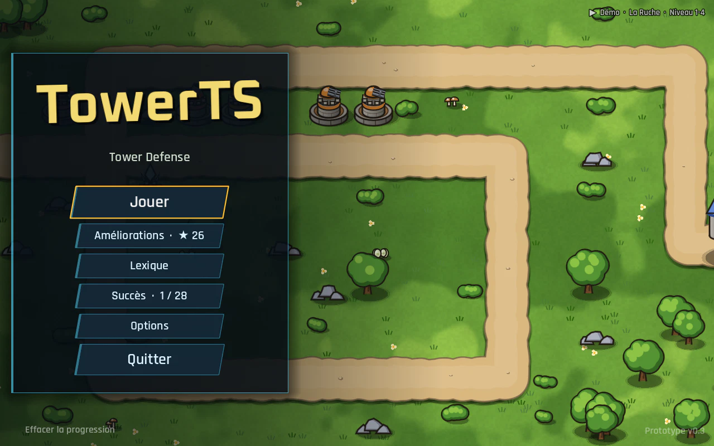 | 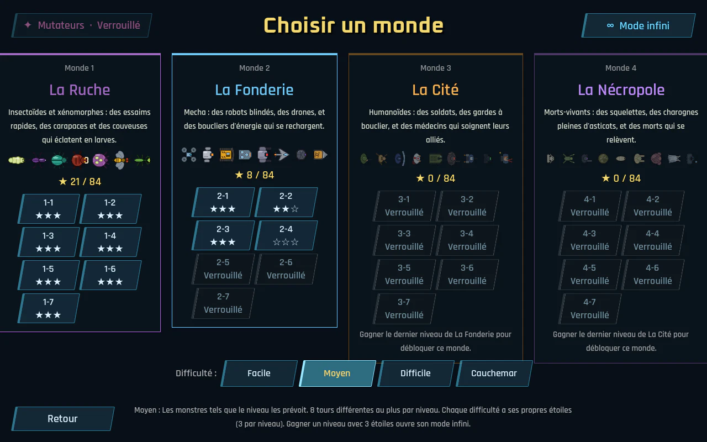 |
| Écran titre : une partie se joue derrière le menu | Quatre mondes de sept niveaux, en quatre difficultés |
| 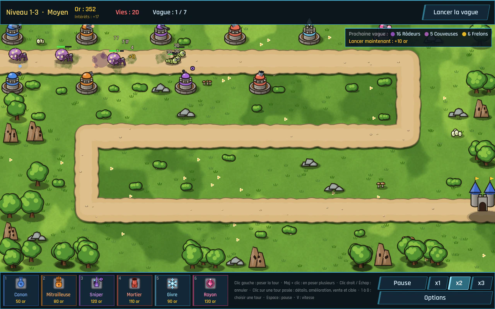 | 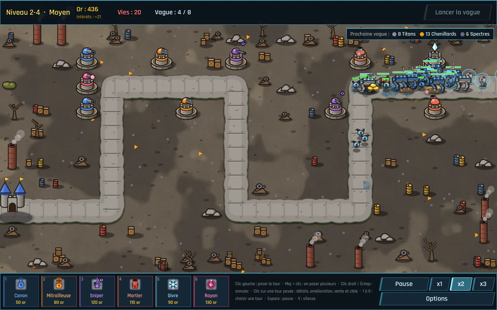 |
| La Ruche : insectoïdes, un porteur de coffre | La Fonderie : robots blindés et boucliers, Tunneliers |
| 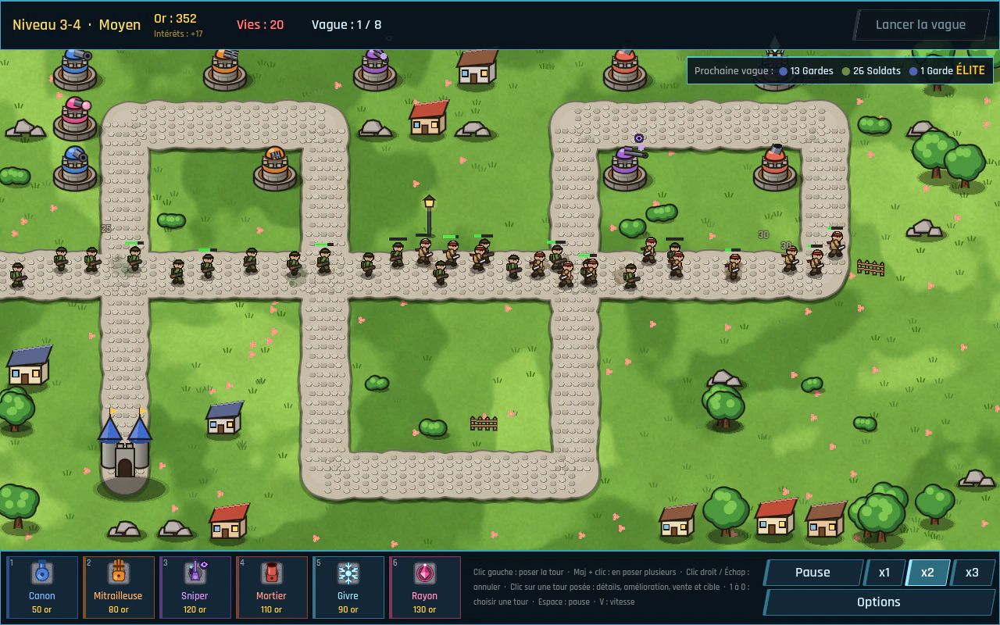 | 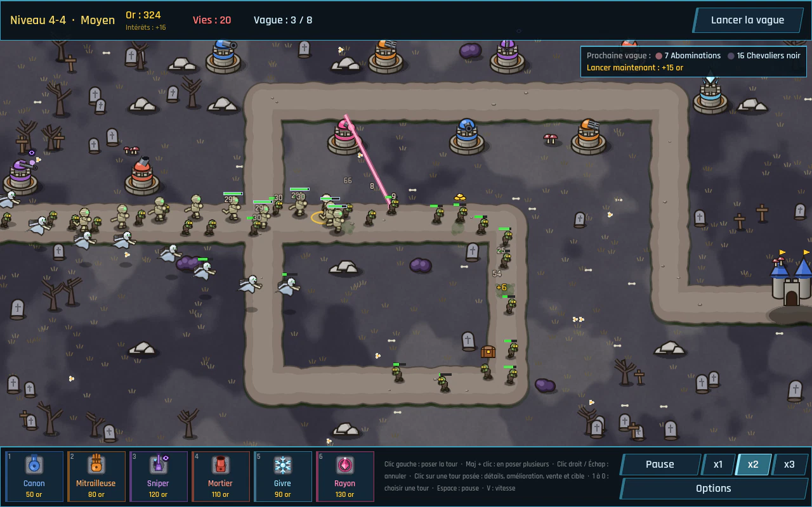 |
| La Cité : des Saboteurs éteignent deux tours | La Nécropole : morts-vivants et Banshees |
| 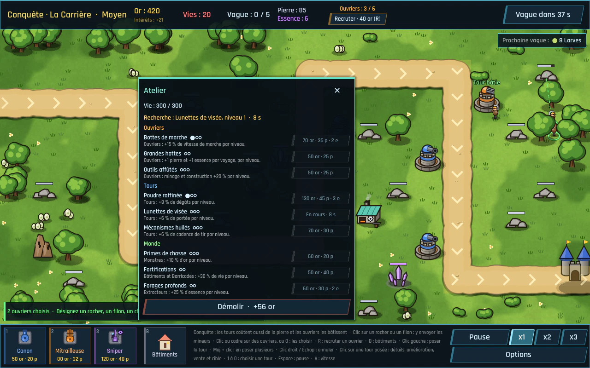 | 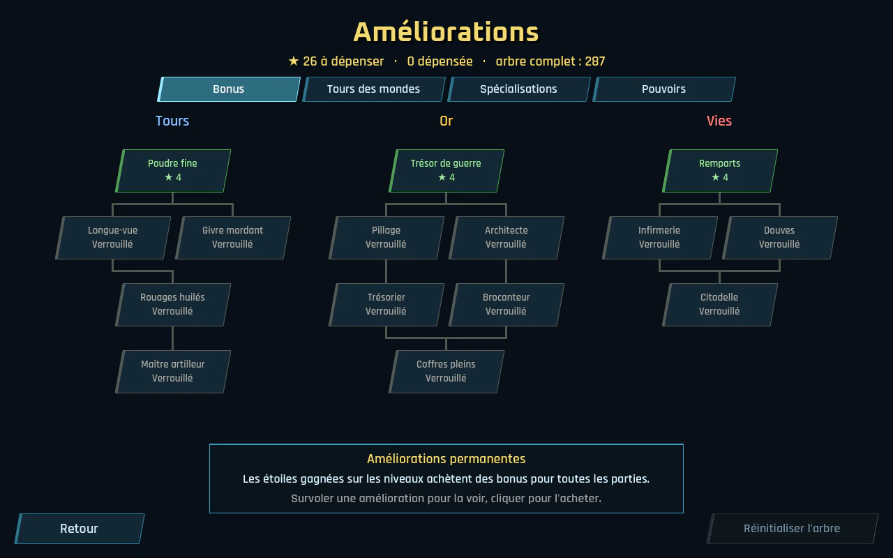 |
| Mode Conquête : ouvriers choisis à la main, Atelier | Les étoiles achètent des améliorations |
| 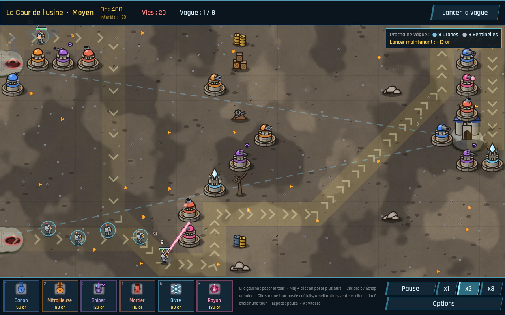 | 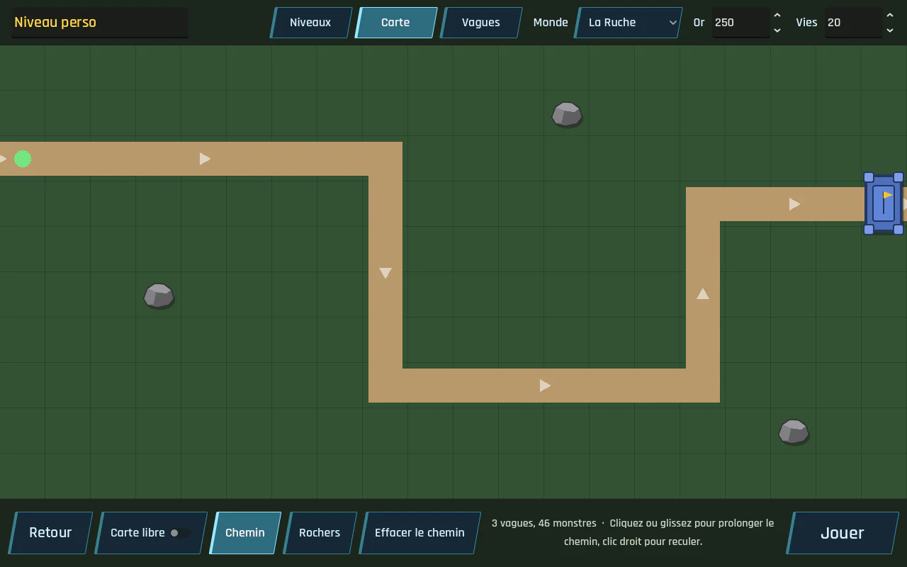 |
| Niveaux libres : les tours font le labyrinthe | Éditeur de niveau, partage par code |
| 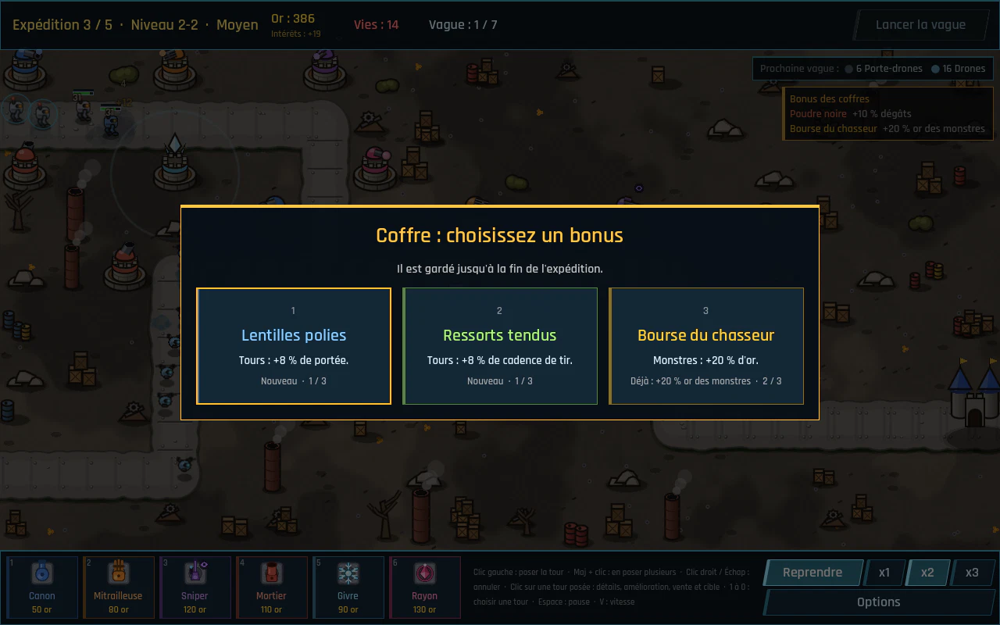 | |
| Expédition : cinq niveaux à la suite, un coffre au choix | |

## Prérequis

- Godot **4.7.2-stable** (version standard, pas .NET) : https://godotengine.org/download

## Lancer le projet

1. Ouvrir Godot, cliquer sur **Importer** et sélectionner le fichier `project.godot`.
2. Appuyer sur **F5** : le jeu démarre sur l'écran titre.

## Télécharger le jeu

Pas besoin d'installer Godot pour jouer : GitHub construit le jeu tout seul (workflow `.github/workflows/build.yml`).

- **Dernière version** : à chaque push sur `main`, la page [Releases](https://github.com/sam-fishermonger/TowerTS/releases) met à jour la pré-release **« Dernière version (main) »** avec quatre fichiers :
  - `TowerTS-windows.zip` : décompresser puis lancer `TowerTS.exe`. Le jeu n'étant pas signé, Windows peut afficher « Windows a protégé votre ordinateur » : **Informations complémentaires** puis **Exécuter quand même**.
  - `TowerTS-linux.zip` : décompresser puis lancer `TowerTS.x86_64`.
  - `TowerTS-web.zip` : la version navigateur, à déposer telle quelle sur un hébergeur (itch.io, GitHub Pages…). Ouvrir `index.html` directement depuis le disque ne marche pas : il faut un serveur web, par exemple `python3 -m http.server` dans le dossier décompressé, puis http://localhost:8000.
  - `TowerTS-android.apk` : la version Android (téléphone ou tablette au processeur 64 bits, soit presque tous les appareils depuis 2017). L'ouvrir depuis le téléphone (par exemple en téléchargeant le fichier depuis la page Releases), puis autoriser l'installation d'applications de cette source quand Android le demande. Une nouvelle version s'installe par-dessus l'ancienne en gardant la progression. Le jeu se joue à l'horizontale, au doigt (voir [Comment jouer](#comment-jouer)).
- **Version numérotée** : créer un tag qui commence par `v` (par exemple `v0.3`, depuis l'onglet Releases de GitHub ou avec `git tag v0.3 && git push origin v0.3`) publie une Release du même nom avec les quatre fichiers.
- **Sur une PR** : les fichiers construits sont dans l'onglet **Actions**, en bas de la page du run (**Artifacts**).

Les fichiers construits ne sont pas commités dans le dépôt : ils pèsent plus de 100 Mo chacun et changeraient à chaque modification, ce qui alourdirait l'historique git pour toujours.

### Exporter soi-même

Les réglages d'export sont dans `export_presets.cfg` (Windows, Linux, Web et Android). Dans l'éditeur : **Éditeur > Gérer les modèles d'export** (une fois, pour télécharger les modèles de Godot 4.7.2), puis **Projet > Exporter**. En ligne de commande :

```
godot --headless --path . --export-release "Windows" build/windows/TowerTS.exe
```

Le dossier `build/` est ignoré par git.

Pour Android, Godot a aussi besoin du SDK Android (chemin dans **Éditeur > Paramètres de l'éditeur > Export > Android**) et d'une clé de signature. L'APK des Releases est signé avec la clé de test `tools/android/towerts-debug.keystore` (alias `androiddebugkey`, mot de passe `android`) : elle ne protège rien, elle sert seulement à ce que chaque version puisse remplacer la précédente sur le téléphone. Pour publier sur le Play Store, il faudra une vraie clé, gardée secrète (dans les secrets GitHub, pas dans le dépôt). En ligne de commande :

```
GODOT_ANDROID_KEYSTORE_RELEASE_PATH=tools/android/towerts-debug.keystore \
GODOT_ANDROID_KEYSTORE_RELEASE_USER=androiddebugkey \
GODOT_ANDROID_KEYSTORE_RELEASE_PASSWORD=android \
godot --headless --path . --export-release "Android" build/android/TowerTS.apk
```

## Comment jouer

- Le menu de l'écran titre est court : **Jouer**, **Améliorations**, **Lexique**, **Succès**, **Options** et **Quitter**. **Jouer** ouvre le choix du mode : **Campagne** (ou **Continuer**), **Tutoriel**, **Mondes**, **Défi du jour**, **Conquête**, **Niveaux libres**, **Expédition** et **Éditeur de niveau** ; **Retour** ou **Échap** revient au menu principal.
- **Tutoriel** : une partie guidée sur un petit niveau de La Ruche (4 vagues). Une bulle explique quoi faire, étape par étape, et un cadre clignotant montre où cliquer : choisir et poser une tour, lancer une vague, l'or, le bonus et les intérêts, la fiche d'une tour (amélioration, cible, vente), les volants, les furtifs et la tour qui les détecte, la pause et la vitesse, puis un pouvoir (le Gel, prêté pour la dernière vague). Les étapes avancent avec ce que fait le joueur : il peut prendre de l'avance, les bulles déjà faites sont sautées. **Passer le tutoriel** ouvre directement le niveau 1-1. La toute première fois, **Campagne** commence par le tutoriel (tant qu'il n'est ni fini ni passé et qu'aucune étoile n'est gagnée), et le bouton **Tutoriel** reste marqué « conseillé ». Il se joue en Moyen, sans l'arbre des améliorations, ne rapporte ni étoiles ni succès, et sa victoire propose **Commencer la campagne**. Les étapes sont dans `scripts/levels/tutorial.gd` (textes passés par `tr()`), le niveau dans `scenes/levels/tutorial.tscn`.
- Sur l'écran titre, une partie se joue toute seule derrière le menu : un niveau de la campagne tiré au hasard (son nom s'affiche en haut à droite), avec des tours posées et améliorées automatiquement. Quand elle se termine, un autre niveau prend la suite. Elle est muette et n'enregistre rien.
- Choisir une tour dans la barre d'achat, en bas à gauche (une case par tour : son image, son nom et son prix, grisée quand l'or manque), ou avec les touches **1 à 9 puis 0** (rangée des chiffres ou pavé numérique, aussi en AZERTY) pour les dix premières cases, dont le chiffre est rappelé dans un coin. Puis cliquer sur une case libre hors du chemin. La même touche repose la tour.
- **Maj + clic** pour poser plusieurs tours d'affilée, **clic droit** ou **Échap** pour annuler.
- Survoler une case de la barre d'achat affiche, juste au-dessus, la fiche de la tour : description, statistiques et prix.
- Cliquer sur une tour posée ouvre sa fiche, avec le bouton **Améliorer** : chaque tour a 2 améliorations (niveau 3 maximum), dont les gains sont affichés en vert avant l'achat.
- Dans la même fiche, **Vendre** retire la tour et rend 70 % de ce qu'elle a coûté (améliorations comprises), et le bouton **Cible** choisit l'ennemi visé en priorité : Premier (le plus avancé, par défaut), Dernier, Le plus fort (le plus de vie) ou Le plus proche. Le Givre frappe tout ce qui est à portée et n'a donc pas ce choix.
- **✕** ou **Échap** ferme la fiche.
- **Lancer la vague** envoie la vague suivante. Chaque ennemi détruit rapporte de l'or, et chaque vague nettoyée donne un bonus. Les ennemis ne marchent pas tous en file au milieu du chemin : chacun tire au hasard sa place sur sa largeur (le tirage dépend du niveau, il est le même à chaque partie).
- Sous le bouton, un encadré annonce la composition de la prochaine vague (élites et boss signalés). Le survoler ouvre sa fenêtre de détail : chaque sorte de monstre avec son nombre, sa vie (difficulté comprise), son armure, son bouclier, sa vitesse, l'or qu'il rapporte, les vies qu'il retire et ses capacités, plus le bonus de la vague.
- Survoler un monstre sur la carte ouvre sa fiche, qui le suit : nom, rang, vie et bouclier restants, statistiques et capacités.
- Lancer la vague alors que des ennemis sont encore en jeu rapporte une prime : la moitié de son bonus, versée tout de suite (réglable dans la propriété `early_call_bonus_ratio` du niveau).
- **Intérêts** : chaque fois que la carte est vidée, l'or gardé rapporte 5 % d'intérêts (25 or au plus), comptés avant le bonus de vague et affichés en « +N intérêts » sous l'or. Le HUD annonce sous l'or ce que rapporterait l'or gardé à ce moment-là. Épargner entre deux vagues rapporte donc un peu, sans dépasser le plafond. Le taux et le plafond se règlent dans les propriétés `interest_rate` et `interest_cap` du niveau.
- **Pouvoirs** : achetés dans l'arbre des améliorations (onglet **Pouvoirs**), ils ont chacun leur bouton en haut de l'écran, à gauche de **Lancer la vague**, et leur touche : **A**, **Z** et **E** en AZERTY (Q, W, E en QWERTY), la lettre étant rappelée dans le coin du bouton. Après chaque usage, un pouvoir se recharge (en temps de jeu : x2 et x3 accélèrent la recharge, la pause l'arrête) ; son bouton montre les secondes restantes. **Météores** et **Renforts** se lancent sur la carte : leur zone suit la souris jusqu'au clic (clic droit ou Échap pour annuler, et la même touche aussi). Le **Gel** part tout de suite. Voir le tableau plus bas.
- Les dégâts infligés s'affichent au-dessus des ennemis touchés. Un ennemi détruit affiche l'or gagné et laisse au sol une tache qui s'estompe en 20 secondes.
- Quand un ennemi atteint la base, l'écran rougit brièvement, le compteur de vies grossit en rouge et « -N » s'affiche à la sortie.
- En bas à droite : **Pause** (ou **Espace**) fige la partie (on peut toujours poser, améliorer et vendre des tours, mais pas lancer de vague), et **x1 / x2 / x3** règlent la vitesse du jeu (**V** passe à la vitesse suivante). Les vitesses proposées se changent dans la propriété `game_speeds` du niveau.
- La partie est perdue quand les vies tombent à 0, gagnée quand toutes les vagues du niveau sont repoussées. Une victoire rapporte des étoiles : 3 sans perdre de vie, 2 en gardant au moins la moitié des vies, 1 sinon. Après une victoire, **Niveau suivant** ouvre le niveau d'après.
- **Difficulté** : en bas de la sélection des mondes, **Facile**, **Moyen**, **Difficile** ou **Cauchemar** règle les parties suivantes (le choix est enregistré, et rappelé en haut à gauche en jeu). Chaque difficulté a ses propres étoiles : un niveau en rapporte jusqu'à 3 par difficulté, soit 12, et 336 pour toute la campagne. Les boutons des niveaux montrent les étoiles de la difficulté choisie (celles des quatre en bulle d'aide), les cartes des mondes le total. Gagner un niveau dans n'importe quelle difficulté débloque le suivant.

  | Difficulté | Vie et bouclier des monstres | Nombre de monstres | Vitesse |
  |---|---|---|---|
  | Facile | -30 % | -25 % | -10 % |
  | Moyen | l'équilibrage des niveaux | | |
  | Difficile | +35 % | +25 % | +10 % |
  | Cauchemar | +75 % | +50 % | +20 % |

  Chaque groupe d'une vague garde à peu près sa durée : les monstres en plus se resserrent, ceux en moins s'espacent. Le mode infini et la partie de l'écran titre se jouent toujours en Moyen. Les réglages sont dans `scripts/data/difficulty.gd`.
- **Tours par niveau** : on ne peut prendre qu'un nombre limité de tours différentes dans un niveau, selon la difficulté : **9** en Facile, **8** en Moyen, **6** en Difficile et **5** en Cauchemar (le mode infini, joué en Moyen, en prend 8). Quand le niveau et l'arbre des améliorations en proposent plus, le niveau s'ouvre sur **Choisir les tours** : une case par tour (sa fiche s'affiche au survol), on en coche jusqu'à la limite, puis **Jouer**. Le dernier choix est coché d'avance au niveau suivant (et en recommençant). Les limites sont dans `TOWER_LIMITS` (`scripts/data/difficulty.gd`).
- **Élites** : chaque niveau a 2 ou 3 monstres élites (aura dorée, « élite » dans leur nom) : vie et bouclier x3, 25 % plus gros, 4 fois plus d'or, 2 vies de plus s'ils passent. Les monstres qu'ils libèrent ou appellent restent normaux.
- **Boss** : un par monde, à la dernière vague des niveaux 3, 6 et 7 (plus coriace au 6). Une aura rouge l'entoure et sa vie s'affiche en haut de la carte tant qu'il est en jeu. La difficulté change sa vie, mais il n'arrive jamais qu'un boss à la fois (en mode infini, il revient avec sa vague, toutes les 3 vagues). Chacun appelle des renforts en marchant :

  | Monde | Boss | Vie | Capacités |
  |---|---|---|---|
  | La Ruche | **Reine de la Ruche** | 4000 (x1,4 au 1-3, x1,5 au 1-6) | Pond 3 Larves toutes les 5 s. |
  | La Fonderie | **Béhémoth** | 3500, bouclier 900, armure 6 (x1,7 au 2-6) | Lâche 2 Drones toutes les 6 s. |
  | La Cité | **Le Général** | 4200, armure 4 (x1,5 au 3-6) | Soigne de 30 points les ennemis autour de lui toutes les 3 s, appelle 3 Soldats toutes les 6 s. |
  | La Nécropole | **La Liche** | 3800, armure 3 (x1,3 au 4-3, x1,5 au 4-6) | Relève 3 Squelettes toutes les 6 s, et se relève elle-même une fois (40 % de sa vie, après 2,5 s) si elle n'est pas consacrée. |

  Un boss coûte 10 vies s'il atteint la base et rapporte 150 à 170 or. Les élites se règlent dans `scripts/data/enemy_data.gd` (`ELITE_*`) ; un groupe de vague devient élite avec sa case `elite` (`SpawnGroup`), qui a aussi son propre multiplicateur de vie (`health_multiplier`). Un ennemi est un boss avec `is_boss`, et appelle des renforts avec le groupe **Renforts** de sa ressource.
- **Porteurs et coffres** : à partir de la deuxième vague, un monstre de chaque vague porte du butin (dessiné au-dessus de sa tête), et toutes les 3 vagues un autre porte un coffre. Ils ont 50 % de vie en plus. Détruits, ils lâchent leur butin sur le chemin : un clic ou un toucher le ramasse, sinon il clignote puis disparaît au bout de 12 s (temps réel, sans la pause) ; un porteur qui atteint la base l'emporte. Le butin est un tas d'or (3 fois l'or du monstre, 15 au moins), et en Conquête aussi de la pierre (15) ou de l'essence (4). Un **coffre** donne au hasard un bonus pour le reste du niveau, affiché sous l'aperçu de la vague, jusqu'à 3 fois le même : Poudre noire (+10 % de dégâts des tours), Lentilles polies (+8 % de portée), Ressorts tendus (+8 % de cadence), Bourse du chasseur (+20 % d'or des monstres), Butin de guerre (+25 % de bonus de vague), Coffre-fort (+2 points d'intérêts, plafond +10), Sablier (recharge des pouvoirs -15 %, avec au moins un pouvoir) et Pioches d'acier (ouvriers +20 %, en Conquête). Tout au maximum, un coffre donne 60 or. En **Expédition**, le coffre propose plutôt trois bonus au choix, gardés jusqu'à la fin de l'expédition (voir plus bas). Les porteurs sont tirés par vague (même niveau, même vague : mêmes porteurs) dans tous les modes sauf le tutoriel. Les règles sont dans `scripts/levels/wave_spawner.gd` (`LOOT_CARRIERS_FROM_WAVE`, `CHEST_EVERY`), `scripts/effects/loot.gd` et `scripts/data/chest_bonus.gd`. Ouvrir 25 coffres, toutes parties confondues, débloque le succès **Chasseur de trésors**.
- **Lexique** (écran titre) : la fiche de chaque tour (statistiques, améliorations, comment la débloquer, spécialisation), de chaque monstre (statistiques, capacités, version élite), des élites et des boss, et de chaque monde (monstres, boss, tours du monde, étoiles). Il lit les ressources du jeu : une tour ajoutée dans `resources/towers/` ou un monstre ajouté à un monde y apparaît tout seul.
- **Statistiques de fin de niveau** : l'écran de fin (victoire, défaite ou fin du mode infini) montre à droite le bilan de la partie : durée (en temps de jeu), monstres détruits (dont élites et boss), dégâts infligés, vies perdues, or dépensé (poses et améliorations) et gagné (monstres, bonus de vague, intérêts, primes, ventes), tours posées et améliorations achetées, et les butins ramassés (dont les coffres). Puis la **meilleure tour**, celle qui a infligé le plus de dégâts (son niveau, ses dégâts, ses destructions), et les **dégâts par tour** : une ligne par type de tour posé, avec le nombre de tours, une barre, les dégâts et leur part. Chaque coup est compté à la tour qui l'a porté, brûlures et poisons compris, et une tour vendue garde ce qu'elle a fait. Le calcul est dans `scripts/levels/level_stats.gd`.
- **Succès** : 29 objectifs à remplir en jouant, dans n'importe quelle difficulté. Un bandeau doré les annonce en jeu au moment où ils sont remplis, et l'écran de fin liste ceux de la partie. **Succès** (écran titre, avec le compte) ouvre leur page : une vignette par succès, grisée tant qu'il n'est pas débloqué, avec l'avancement des objectifs chiffrés et la date du déblocage. La partie de l'écran titre n'en débloque pas, et **Effacer la progression** les garde.

  | Succès | Objectif |
  |---|---|
  | Premier pas | Gagner un niveau. |
  | Sans une égratignure | Gagner un niveau sans perdre de vie. |
  | Sur le fil | Gagner un niveau avec une seule vie restante. |
  | La Ruche nettoyée, La Fonderie éteinte, La Cité libérée, La Nécropole apaisée | Gagner tous les niveaux du monde. |
  | Régicide, Démolition, Coup d'État, Requiem | Vaincre la Reine de la Ruche, le Béhémoth, le Général, la Liche (mode infini compris ; la Liche doit tomber pour de bon). |
  | Commando | Vaincre un boss avec 3 tours ou moins sur la carte. |
  | Minimaliste | Gagner un niveau en posant 5 tours au plus (ventes comprises). |
  | Brut de pose | Gagner un niveau sans améliorer aucune tour. |
  | Monoculture | Gagner un niveau avec un seul type de tour. |
  | Impatient | Lancer 5 vagues en avance dans une même partie. |
  | Trésor de guerre | Gagner un niveau avec 1000 pièces d'or en poche. |
  | Cauchemar vaincu | Gagner un niveau en Cauchemar. |
  | Infatigable | Repousser 30 vagues dans une partie du mode infini. |
  | Chasseur d'élites | Détruire 50 monstres élites (toutes parties confondues). |
  | Exterminateur | Détruire 5000 monstres (toutes parties confondues). |
  | Constellation | Obtenir 100 étoiles. |
  | Jardinier | Acheter 15 améliorations dans l'arbre. |

  Le code Konami, qui gagne tous les niveaux et achète tout l'arbre, débloque du même coup les succès de mondes, d'étoiles et de l'arbre. Les succès sont dans `scripts/save/achievements.gd` (`LIST`) : un succès s'ajoute là, avec son objectif.
- Dans la sélection des mondes, survoler un niveau (ou lui donner le focus au clavier) ouvre sa fenêtre de détail : or et vies de départ, et le contenu de chaque vague dans la difficulté choisie, élites et boss compris.
- La campagne compte **quatre mondes** de 7 niveaux, un par biome, chacun avec ses monstres : **La Ruche** (insectoïdes et xénomorphes), **La Fonderie** (mecha), **La Cité** (humanoïdes) et **La Nécropole** (morts-vivants). **Mondes** (écran titre) ouvre la sélection : une carte par monde, avec ses monstres, ses étoiles et un bouton par niveau. Le 7e niveau de chaque monde est un **niveau libre** (voir plus bas) : pas de chemin, les tours font le labyrinthe, et la fenêtre de détail du niveau le signale. Il compte comme les autres pour le mode infini et peut tomber au Défi du jour.
- La progression est enregistrée : chaque niveau gagné débloque le suivant, et gagner le dernier niveau d'un monde débloque le monde suivant (l'écran de victoire propose alors **Monde suivant**). La sélection affiche le meilleur résultat de chaque niveau. **Jouer > Continuer** reprend au premier niveau pas encore gagné ; **Effacer la progression** (en bas à gauche de l'écran titre) repart de zéro.
- **Mode infini** : un niveau gagné avec 3 étoiles (dans n'importe quelle difficulté) s'ouvre en mode infini (bouton **∞ Mode infini** en haut à droite de la sélection des mondes, qui fait passer les cartes au mode infini). Après les vagues du niveau, d'autres arrivent sans fin : elles reprennent en boucle ses 3 dernières vagues, avec à chaque fois 10 % d'ennemis en plus et 13 % de vie (et de bouclier) en plus, d'une vague à l'autre. La partie s'arrête quand les vies tombent à 0. Chaque vague repoussée est enregistrée : record de vagues (en bulle d'aide sur le bouton du niveau) et **étoiles infinies**, en bleu, une toutes les 5 vagues repoussées au-delà de celles du niveau, jusqu'à 5 par niveau (140 en tout). Elles sont une monnaie à part, qui achète les spécialisations des tours. Les réglages sont dans `scripts/levels/wave_spawner.gd` (`ENDLESS_*`) et `scripts/save/progress.gd`.
- **Défi du jour** (écran titre, sous **Jouer**) : chaque jour, un niveau de la campagne tiré au sort avec des règles imposées, le même toute la journée (le tirage ne dépend que de la date). Le défi impose 4 tours (au plus une Bobine ou un Électroaimant), et ajoute 2 règles parmi celles-ci :

  | Règle | Effet |
  |---|---|
  | Monstres rapides | Les monstres vont 30 % plus vite. |
  | Monstres coriaces | 35 % de vie (et de bouclier) en plus. |
  | Hordes | 40 % de monstres en plus dans chaque groupe. |
  | Bourse serrée | 30 % d'or en moins au départ. |
  | Vies comptées | 5 vies seulement. |
  | Sans amélioration | Les tours ne s'améliorent pas. |

  Un jour sur trois environ, **Deux tours seulement** remplace les 4 tours imposées par 2 tours qui font des dégâts. L'arbre des améliorations ne compte pas pendant le défi (ni bonus, ni tours débloquées, ni spécialisations), et la partie se joue en Moyen : tout le monde a les mêmes chances. Le défi ne rapporte pas d'étoiles mais un **score** : 10 points par pièce d'or que rapporte un monstre détruit, 100 par vague repoussée et, en cas de victoire, 50 par vie gardée ; une défaite garde les points marqués. L'écran du défi montre le niveau, les tours et les règles du jour, puis l'**historique** : meilleur score du jour, record de tous les défis, **série** de jours réussis d'affilée (le défi du jour pas encore gagné ne la coupe pas : elle compte alors jusqu'à hier) et meilleure série, et les scores des derniers jours (une croix ✕ marque les défis perdus). L'écran de fin d'un défi gagné annonce la série en cours. Le score s'affiche en jeu à côté des vagues, avec les règles en bulle d'aide. Les règles et le score se règlent dans `scripts/data/daily_challenge.gd`, l'historique dans `scripts/save/progress.gd` (sections `daily` et `daily_won`).
- **Mutateurs** : le bouton **✦ Mutateurs**, en haut à gauche de la sélection des mondes, ouvre le choix des règles du défi du jour (Monstres rapides, Monstres coriaces, Hordes, Bourse serrée, Vies comptées, Sans amélioration) à activer sur les **niveaux de la campagne déjà gagnés**, en plus de la difficulté choisie. Le choix est gardé pour les parties suivantes ; les boutons des niveaux concernés passent en rose, la fenêtre de détail du niveau et le bas de l'écran rappellent les mutateurs actifs. En jeu, les règles s'affichent au milieu de la carte jusqu'à la première vague (après le choix des tours), puis restent en bulle d'aide sur **✦ Mutateurs** dans la barre du haut. Une victoire rapporte, en plus des étoiles habituelles, **une étoile infinie par mutateur actif, 3 au plus par niveau** (meilleur résultat gardé, visible en bulle d'aide sur le bouton du niveau) : de quoi acheter les spécialisations sans passer par le mode infini. Ni le mode infini ni le défi du jour n'ont de mutateurs. Les réglages sont dans `scripts/data/mutators.gd`.
- **Conquête** (écran titre, sous **Jouer**) : un mélange de tower defense et de RTS, en **6 niveaux** à ouvrir dans l'ordre (La Carrière, La Mine de fer, Les Faubourgs, Les Catacombes, Le Nid de la Reine, Le Dédale), chacun avec ses étoiles par difficulté, qui comptent pour l'arbre des améliorations. Les tours coûtent de l'or **et de la pierre** (40 % de leur prix en or : 20 pour un Canon), et leurs améliorations à partir du niveau 3 demandent aussi de l'**essence** (3, puis 6). Des **ouvriers** minent la pierre des rochers (30 chacun, jauge sous le rocher) et l'essence des **filons** violets (16 chacun, 2 par voyage), et la rapportent au **QG** ou au **Dépôt** le plus proche ; un ouvrier va de lui-même sur un filon, et un clic sur un rocher ou un filon y envoie les mineurs. Une tour ou un bâtiment posé n'est d'abord qu'un **chantier**, que les ouvriers bâtissent (2 au plus par chantier quand le jeu les répartit) ; démoli avant d'être fini, il rend tout son prix. Le bouton **Bâtiments** (ou **B**, puis les chiffres) ouvre six bâtiments : le **Dépôt** (point de dépôt près des ressources lointaines), la **Maison** (+2 ouvriers au plus), l'**Extracteur** (posé sur un filon, 1 essence toutes les 6 s sans ouvrier), la **Barricade** (posée sur le chemin, les monstres au sol doivent la casser), la **Caserne** (2 soldats sur le chemin, remplacés au bout de 12 s) et l'**Atelier** (voir plus bas). Un clic sur un bâtiment ouvre sa fiche (vie, chantier, **Démolir**). **Ouvriers choisis** : un clic sur un ouvrier le choisit (Maj + clic en ajoute, au tactile chaque toucher en ajoute ou en retire un), un cadre tiré depuis une case vide choisit tous ceux qu'il entoure, et le compteur des ouvriers de la barre du haut (ou **O**) les choisit tous. Un clic (ou un clic droit) sur un rocher, un filon, un chantier ou le QG y envoie les ouvriers choisis, à autant qu'on veut sur la même tâche : ils minent ce gisement voyage après voyage jusqu'à le vider, bâtissent ce chantier jusqu'au bout (chacun à sa place autour, et chacun ajoute sa part), ou restent à l'abri au QG, puis reviennent aux ordres automatiques. La barre des ouvriers choisis (au-dessus de la barre d'achat) a **Au QG**, **Automatique** (les rendre au jeu) et ✕ ; un clic sur une case vide ou **Échap** les relâche. L'**Atelier** lance, une à la fois, des améliorations qui valent pour le reste de la partie, contre de l'or, de la pierre et parfois de l'essence, avec un temps de recherche (15, 25 puis 35 s) : pour les **ouvriers** (Bottes de marche : +15 % de vitesse, Grandes hottes : +1 pierre et +1 essence par voyage, Outils affûtés : minage et construction +20 %), pour les **tours** (Poudre raffinée : +8 % de dégâts, Lunettes de visée : +6 % de portée, Mécanismes huilés : +6 % de cadence) et pour le **monde** de la carte en cours (Primes de chasse : +10 % d'or par monstre, Fortifications : +30 % de vie des bâtiments, Forages profonds : Extracteurs +25 % plus rapides), par niveau (2 ou 3 niveaux chacune). Deux Ateliers cherchent deux améliorations différentes en même temps ; un Atelier démoli en pleine recherche la rend, un Atelier détruit la perd. On commence avec quelques ouvriers et de la pierre selon le niveau, et **Recruter** (ou **R**) en ajoute un pour 40 or, jusqu'à 6 (14 avec des maisons). Les ouvriers attendent au bord du chemin qu'il soit libre, se soignent au QG, et un ouvrier tombé perd sa charge. Des **Pillards** (un par monde : Pillarde, Récupérateur, Maraudeur, Pilleur de tombes) arrivent avec les vagues, quittent le chemin pour frapper les ouvriers et les bâtiments proches, puis y reviennent. Les vagues partent seules : 45 s avant la première, puis 25 s après chaque carte vidée. La fin de partie ajoute la pierre et l'essence récoltées, les bâtiments bâtis et les ouvriers perdus, et cinq succès sont propres au mode. **Le Dédale** se joue sur une carte libre : pas de chemin, les tours **et les bâtiments** font le labyrinthe (sauf la Barricade, posée sur le chemin actuel, que les monstres cassent pour passer), un bâtiment qui fermerait le passage est refusé comme une tour, et chaque rocher miné ouvre un nouveau passage. Les réglages sont dans `scripts/levels/conquest.gd`, `scripts/entities/building.gd`, `scripts/entities/worker.gd`, `scripts/data/research.gd` (améliorations de l'Atelier) et les scènes `scenes/levels/conquest_0*.tscn`.
- **Niveaux libres** (écran titre, sous **Jouer**) : **4 niveaux** sans chemin tracé (La Clairière, La Cour de l'usine, La Grand-Place, Le Cimetière, un par monde), à ouvrir dans l'ordre, avec leurs étoiles par difficulté qui comptent pour l'arbre des améliorations. La carte n'a que des **terriers** (les points d'apparition des monstres, au bord) et le **QG** : les monstres au sol y vont par le plus court chemin (8 directions, sans couper le coin d'un obstacle) entre les rochers et les **tours, qui servent de murs**. Le chemin est recalculé à chaque tour posée ou vendue, et les monstres déjà en route repartent de là où ils sont. Une tour qui fermerait le passage (depuis un terrier, ou là où marche un monstre) est refusée, avec « Fermerait le passage » au-dessus de l'aperçu ; pendant la pose, le chemin qu'auraient les monstres avec la tour s'affiche en tirets orange. Le chemin actuel reste affiché, plus discret, pendant les vagues. Les volants vont tout droit du terrier au QG. Le calcul est dans `scripts/map/game_map.gd` (`free_layout`, `spawn_cells`, `base_cell`), les niveaux dans `scripts/data/free_levels.gd` et `scenes/levels/free_0*.tscn`. On retrouve des cartes libres dans tous les modes : le 7e niveau de chaque monde de la campagne (et donc le mode infini et le Défi du jour), Le Dédale en Conquête, et la case **Carte libre** de l'éditeur.
- **Expédition** (écran titre, sous **Jouer**, ouvert avec 5 niveaux de la campagne débloqués) : **5 niveaux tirés au sort** à la suite parmi ceux débloqués, de plus en plus durs (la liste est coupée en 5 tranches, un niveau par tranche), dans la difficulté choisie. Les **vies restantes passent d'une étape à l'autre** : on part avec celles de la première étape (arbre compris), l'Infirmerie n'en rend jamais plus, et une défaite met fin à l'expédition. Chaque **coffre** met la partie en pause et propose **trois bonus au choix** (clic ou touches 1, 2, 3), gardés jusqu'à la fin de l'expédition ; un deuxième coffre ramassé entre-temps propose les siens juste après. L'expédition ne donne pas d'étoiles : son record (étapes franchies) s'affiche sur le bouton, et **Nouvelle expédition** en relance une, avec un nouveau tirage. Le tirage et les records sont dans `scripts/data/expedition.gd`, le choix du coffre dans `scripts/ui/chest_choice.gd`.
- **Éditeur de niveau** (écran titre, sous **Jouer**) : on fait son propre niveau, puis on le joue. Sur l'onglet **Carte**, l'outil **Chemin** trace le chemin des ennemis case par case : il part d'une case du bord de la carte (elles sont surlignées tant qu'il n'y a pas de chemin), chaque clic ou glisser le prolonge (une case qui n'est pas dans l'alignement passe par un coin), cliquer sur le chemin le coupe à cet endroit et le clic droit le fait reculer d'une case. Le chemin ne se croise pas, et la base est posée au bout. L'outil **Rochers** pose ou enlève des rochers, où l'on ne construit pas. L'onglet **Vagues** compose jusqu'à 15 vagues de 1 à 4 groupes chacune : un monstre de n'importe quel monde (boss compris, un seul à la fois), son nombre et sa version élite. En haut, le monde donne le sol, le chemin et le décor de la carte, avec l'or et les vies de départ ; l'aperçu est dessiné en vue de trois quarts comme en jeu (sol, chemin, rochers, terriers et QG du monde choisi), quadrillage en plus. **Jouer** lance la partie, avec les 6 tours de base et celles débloquées dans l'arbre, dans la difficulté choisie. Elle ne rapporte ni étoiles ni succès, et l'écran de fin propose **Retour à l'éditeur**. Tant qu'un niveau n'est pas jouable (pas de chemin, pas de vague), le bas de l'écran dit pourquoi. On garde jusqu'à 30 niveaux, enregistrés avec la progression : le nom du niveau ouvert se modifie en haut à gauche, et l'onglet **Niveaux** les liste pour en créer un nouveau, en ouvrir, en dupliquer ou en supprimer (deuxième clic pour confirmer). **Copier le code** met un niveau jouable dans le presse-papiers sous forme d'une ligne de texte (`TTS1-...`, environ 200 caractères) : collée dans le champ **Code reçu** d'un autre joueur puis **Importer**, elle y ajoute le niveau. Le code est le niveau en JSON compressé puis écrit en base64 ; à l'import, tout est vérifié et borné, et seuls les monstres proposés par l'éditeur sont acceptés. La case **Carte libre** fait un niveau libre : plus de chemin tracé, mais les outils **Terriers** (1 à 3, sur des cases du bord, un clic pose ou enlève) et **QG** (n'importe quelle case hors des terriers) ; les cases que les rochers coupent du QG sont assombries, et un terrier sans passage jusqu'au QG empêche de jouer. Les groupes des vagues se partagent les terriers à tour de rôle. Le code de partage garde la carte libre. Le format du niveau et les réglages des vagues (écart entre les monstres, bonus d'or) sont dans `scripts/data/custom_level.gd`.
- **Améliorations** (écran titre) ouvre l'arbre des améliorations permanentes, payées avec les étoiles gagnées sur les niveaux. Quatre onglets :
  - **Bonus**, en trois branches : **Tours** (dégâts, portée, cadence, ralentissement), **Or** (or de départ, or par ennemi, bonus de vague, prix réduits, meilleure revente) et **Vies** (vies de départ, vies rendues à chaque vague repoussée) ;
  - **Tours des mondes** : une branche par monde, avec deux nouvelles tours chacune, puis les **croisements**, qui demandent deux tours de branches différentes (voir plus bas). La branche d'un monde s'ouvre quand ce monde est débloqué, et une tour achetée s'ajoute aux tours proposées dans tous les niveaux ;
  - **Spécialisations**, payées en étoiles infinies : un atout de plus pour chacune des 12 tours de base et des mondes, en trois branches (voir plus bas). Celle d'une tour des mondes demande d'avoir débloqué la tour. La fiche d'une tour rappelle sa spécialisation, déjà comptée dans ses statistiques.
  - **Pouvoirs** : les trois pouvoirs actifs, payés en étoiles (le Gel s'ouvre avec La Fonderie, les Renforts avec La Cité), et sous chacun deux renforts payés en étoiles infinies (voir plus bas).

  Chaque amélioration se débloque quand celles qui la précèdent sont achetées. Les prix montent le long de chaque branche (4 étoiles pour la première amélioration, jusqu'à 20 pour la Cloche funèbre) : l'arbre complet coûte 332 étoiles, sur les 336 de la campagne dans les quatre difficultés. Les étoiles de Facile et Moyen suffisent pour les premières améliorations et les tours des mondes ; il faut aller chercher celles de Difficile et Cauchemar pour finir l'arbre, et ces deux difficultés demandent justement des améliorations. Les spécialisations coûtent 42 étoiles infinies, et les renforts des pouvoirs 21. Il faut choisir, et **Réinitialiser l'arbre** rend toutes les étoiles pour essayer une autre combinaison. Les améliorations, leurs prix et leurs bonus se règlent dans `resources/perk_tree.tres`.

- **Code Konami** : sur l'écran titre, **↑ ↑ ↓ ↓ ← → ← → B A** débloque tout : tous les niveaux gagnés avec 3 étoiles dans les quatre difficultés (donc tous les mondes et tous les modes infinis), toutes les étoiles infinies (mode infini et mutateurs), toutes les améliorations et toutes les spécialisations. **Effacer la progression** revient en arrière. Les lettres suivent la disposition du clavier (le A d'un clavier AZERTY).
- Chaque tour a son bruit de tir, et les explosions, les ennemis détruits, les achats, les vagues et la fin de partie ont le leur, avec une musique en boucle.
- **Options** (écran titre, ou en bas à droite en jeu, ce qui met la partie en pause le temps des réglages) : **Langue** (Français ou English, voir [Langues](#langues)) ; **Musique** et **Sons** ont chacun leur case pour les couper et leur curseur de volume ; **Plein écran** (aussi **F11** ou **Alt + Entrée** à tout moment ; absent sur Android, où le jeu occupe déjà tout l'écran) ; **Vitesse au départ** : x1, x2 ou x3, la vitesse à laquelle chaque niveau commence. Tout s'applique et s'enregistre tout de suite. Sur la version web, le navigateur ne rouvre pas le plein écran tout seul au lancement : il se redemande dans les Options.
- **Au tactile** (téléphone, tablette, version web) : toucher une tour de la barre d'achat, puis une case : l'aperçu de la tour s'y affiche (portée, et en rouge si elle ne peut pas s'y poser) avec « Touchez encore pour poser » ; un second toucher sur la même case la pose, un toucher ailleurs déplace l'aperçu. Toucher encore la tour dans la barre annule. Toucher une tour posée ouvre sa fiche, toucher la carte ailleurs la ferme ; toucher un monstre ouvre la sienne. Dans la sélection des mondes et l'arbre des améliorations, le premier toucher sur un niveau ou une amélioration ouvre sa fiche, le second le lance ou l'achète. Le jeu se joue à l'horizontale : tenu en hauteur, l'écran invite à tourner l'appareil. Le jeu passe tout seul en mode tactile au premier toucher, et revient à la souris dès qu'elle bouge (`scripts/save/game_settings.gd`).

### Pouvoirs

| Pouvoir | Prix | Effet | Recharge | Renforts (étoiles infinies) |
|---|---|---|---|---|
| **Météores** | ★ 5 | 6 météores tombent l'un après l'autre dans un rayon de 70 pixels autour du point visé ; chacun fait 80 dégâts à tous les ennemis à 46 pixels de son point de chute. | 40 s | **Pluie battante** (∞ 3) : +50 % de dégâts. **Comètes** (∞ 4) : recharge 30 % plus rapide. |
| **Gel** | ★ 5, avec La Fonderie | Tous les ennemis de la carte s'arrêtent pendant 3 s (ni marche, ni soins, ni renforts appelés). Un boss ne gèle pas : il ralentit de moitié. | 55 s | **Blizzard** (∞ 3) : 2 s de plus. **Engelures** (∞ 4) : les ennemis gelés subissent 30 % de dégâts en plus. |
| **Renforts** | ★ 6, avec La Cité | 3 soldats (150 vie, 24 dégâts/s) se postent sur le chemin, au plus près du point visé, pendant 20 s. Chacun arrête un ennemi à sa portée et le combat ; l'ennemi retenu le frappe (12 vie/s par vie qu'il coûterait en passant). Les boss ne s'arrêtent pas, mais un soldat libre les frappe au passage. | 45 s | **Vétérans** (∞ 3) : +50 % de vie et de dégâts. **Escouade** (∞ 4) : 2 soldats de plus. |

Un pouvoir est une ressource `Power` (`resources/powers/`). L'amélioration qui le débloque a son chemin dans `unlocks_power`, et celles qui le renforcent dans `improves_power`, avec les champs du groupe **Pouvoirs** de `Perk` (dégâts, recharge, durée, nombre, vulnérabilité).

### Spécialisations

| Branche | Tour | Spécialisation | Prix | Effet |
|---|---|---|---|---|
| Précision | Mitrailleuse | Balles perforantes | ∞ 2 | Ses balles ignorent l'armure. |
| Précision | Sniper | Tir en pleine tête | ∞ 3 | +40 % de dégâts, +10 % de portée. |
| Précision | Franc-tireur | Lunette thermique | ∞ 4 | Tire 35 % plus vite. |
| Précision | Perforateur | Surcharge | ∞ 5 | +40 % de dégâts. |
| Zone | Canon | Boulets lourds | ∞ 2 | +35 % de dégâts, +10 % de portée. |
| Zone | Mortier | Obus incendiaires | ∞ 3 | Ses explosions brûlent : 8 dégâts/s pendant 2 s, sous l'armure. |
| Zone | Lance-flammes | Napalm | ∞ 4 | Brûlure de 8 dégâts/s en plus, 1,5 s de plus. |
| Zone | Pesticide | Nuage tenace | ∞ 5 | Nuage 30 % plus large, 2 s de plus. |
| Contrôle | Givre | Zéro absolu | ∞ 2 | Ralentit 30 % plus fort, 1 s de plus. |
| Contrôle | Rayon | Focalisation | ∞ 3 | Montée en puissance jusqu'à x4,5 au lieu de x3. |
| Contrôle | Brouilleur IEM | Surtension | ∞ 4 | +50 % de dégâts, boucliers brouillés 2 s de plus. |
| Contrôle | Lacrymogène | Gaz suffocant | ∞ 5 | Son nuage empoisonne aussi : 10 dégâts/s, sous l'armure. |

Une spécialisation est une amélioration de l'arbre (`Perk`) avec `paid_with_endless_stars` et `specializes_tower` (la tour visée) : ses bonus de tour (groupes **Tours** et **Spécialisation**) ne s'appliquent qu'à cette tour.

## Images

Les tours, les ennemis, les rochers et la base sont des images SVG dans `assets/sprites/` (importées en 2x pour rester nettes). Chaque type de tour a sa tourelle (`turret_texture`, qui pivote vers la cible sauf si `turret_rotates` est décoché) posée sur un socle commun ; chaque ennemi a son image (`texture`), tournée dans le sens de la marche. Sans image, la tour ou l'ennemi est dessiné en code comme avant : on peut remplacer les SVG par d'autres images sans toucher au code.

Chaque biome a ses **tuiles** (`assets/sprites/tiles/<biome>.png`, une planche de 8 x 3 tuiles de 64 pixels, lue par le `TileSet` de `resources/tilesets/`) :

- 8 sols, en gris, teintés avec la couleur du sol du niveau (`ground_color`) : sol organique en alvéoles pour La Ruche, plaques de métal rivetées (tôle striée, grilles d'aération) pour La Fonderie, dalles et pavés pour La Cité, terre sèche craquelée et dalles funéraires pour La Nécropole ;
- 8 détails en couleur semés sur le sol libre (œufs, bave, champignons ; taches d'huile, boulons, câbles ; herbes, plaques d'égout, feuilles mortes ; os, crânes, bougies…) ;
- 4 obstacles qui remplacent les rochers des cases bloquées (ruches, sacs d'œufs, épines ; caisses, barils, machines ; murs en ruine, arbres, barricades ; tombes, croix, colonnes brisées, arbres morts), teintés avec `rock_color`, et 4 petits détails semés sur le chemin (cailloux, fissures).

La carte (`GameMap`) prend les tuiles du monde de son niveau (`tileset` de `resources/worlds/*.tres`) et les pose en deux calques `TileMapLayer` sous le chemin ; un niveau peut en choisir d'autres dans sa propriété `tileset`, ou régler `decal_density` et `path_detail_spacing`. Le tirage dépend du niveau : la carte est la même à chaque partie. Les tuiles sont dessinées par `tools/generate_tilesets.py` (Python 3, Pillow et numpy) : modifier le script puis le relancer réécrit les planches (`python3 tools/generate_tilesets.py undead` ne réécrit que celle d'un biome).

## Interface

Toute l'interface suit un même style, « console tactique » : fonds ardoise translucides, liserés cyan, angles vifs et boutons inclinés, texte en Rajdhani et titres en Oxanium. Il est défini dans `scripts/ui/ui_style.gd` : le thème global du projet (`resources/ui/theme.tres`) et les styles posés par le code (cases de la barre d'achat, cartes des mondes, fiches, succès...) en viennent tous, en gardant chacun sa couleur d'accent (celle de la tour, du monde ou de l'état). Après une modification de `ui_style.gd`, regénérer le thème :

```
godot --headless --path . -s res://tools/generate_theme.gd
```

Pour donner la police des titres à un Label d'une scène, mettre `TitreEcran` dans sa propriété « Theme Type Variation ».

### Vue de trois quarts

Toutes les cartes sont dessinées en vue de trois quarts, façon Kingdom Rush. Le sol est peint (`scripts/map/relief_ground.gdshader`) et le chemin a des bords irréguliers. Chaque monde a son décor debout (`scripts/map/biome_theme.gd`, `scripts/map/decor_item.gd`) : arbres, termitières et œufs à La Ruche ; caisses, tonneaux, ferraille et cheminées sur la terre cendrée de La Fonderie, avec un chemin de plaques rivetées ; maisons, réverbères et barrières à La Cité, avec un chemin pavé ; arbres morts, tombes et croix à La Nécropole. Les tours sont de petits donjons crénelés sur un socle de pierre, avec leur arme vue de biais (`scripts/towers/tower_relief.gd`). Les monstres sont dessinés de profil, avec une ombre juste sous eux (`scripts/enemies/creature.gd`). La base est un petit château. Tout ce qui se tient debout est trié en profondeur : ce qui est plus bas sur l'écran passe devant.

Le jeu reste à plat en dessous (positions, portées, chemins) : seul l'affichage change. Poser une tour abat le décor de sa case, sauf les rochers. Décocher la propriété `relief` de `Map` dans un niveau rend l'ancienne vue de dessus, en tuiles.

## Sons

Tous les sons et la musique sont synthétisés par `tools/generate_sounds.py` (Python 3 et ffmpeg), sans banque de sons : modifier le script puis le relancer réécrit les fichiers de `assets/audio/`. Le son de tir d'une tour se choisit dans sa ressource (`attack_sound`).

## Mondes et monstres

Chaque monde a ses monstres, rangés dans `resources/enemies/<biome>/` avec leur image dans `assets/sprites/enemies/<biome>/`. Les rôles se répondent d'un monde à l'autre (un ennemi de base, un rapide, un blindé, un qui se divise, un gros), et chaque biome a sa spécialité.

| Monde | Monstres | Spécialité |
|---|---|---|
| 1. La Ruche (insectoïdes) | Larve, Rôdeur (rapide), Scarabée (carapace : les petits dégâts rebondissent), Ravageur (gros), Couveuse (éclate en 3 Larves) | Les essaims et les ennemis qui se divisent |
| 2. La Fonderie (mecha) | Drone (rapide), Sentinelle, Chenillard (très blindé), Porte-drones (libère 3 Drones), Titan (énorme), Tunnelier (creuse sous le chemin) | **Bouclier d'énergie** (Sentinelle, Titan) : il encaisse les coups en premier, sans armure, et se recharge après 2 secondes sans être touché. Une barre bleue s'affiche au-dessus de la barre de vie. |
| 3. La Cité (humanoïdes) | Soldat, Éclaireur (rapide), Garde (bouclier anti-émeute : armure), Médecin, Transport de troupes (libère 4 Soldats), Colosse (énorme), Saboteur (éteint les tours) | **Soin** (Médecin) : il rend régulièrement des points de vie aux ennemis blessés autour de lui (onde et « +N » verts). Mieux vaut l'abattre en premier. |
| 4. La Nécropole (morts-vivants) | Squelette, Goule (rapide), Chevalier noir (armure), Charogne (libère 4 Asticots), Asticot, Momie, Abomination (énorme) | **Résurrection** (Chevalier noir, Momie, la Liche) : abattus, ils tombent puis se relèvent sur place une fois (tache violette, « Se relève ! »), avec une partie de leur vie. Ils ne rapportent leur or qu'à leur vraie mort. Un ennemi **consacré** par l'Encensoir (petite croix dorée) ne se relève pas. |

Le bouclier, le soin, les renforts et la résurrection se règlent dans la ressource de l'ennemi (`EnemyData`, groupes **Bouclier**, **Soin**, **Renforts** et **Résurrection**) : n'importe quel ennemi peut en avoir. Sa `description` est celle du lexique.

### Volants et furtifs

Chaque monde a aussi un monstre volant et un monstre furtif :

| Monde | Volant | Furtif |
|---|---|---|
| La Ruche | **Frelon** (dès le 1-2) | **Mante** (dès le 1-4), armure 3 |
| La Fonderie | **Chasseur** (dès le 2-2), bouclier | **Spectre** (dès le 2-3), bouclier |
| La Cité | **Aviateur** (dès le 3-2), armure 2 | **Infiltré** (dès le 3-3), armure 2 |
| La Nécropole | **Banshee** (dès le 4-2) | **Revenant** (dès le 4-3), armure 2, se relève une fois |

- **Volants** : ils survolent le chemin en coupant les virages (ils vont tout droit d'un virage sur deux, en arrondissant), avec leur ombre au sol, et passent au-dessus des tours. Avant la première vague, leur trajet s'affiche en pointillés bleus à côté des flèches du chemin. Les tours qui tirent au sol ne les touchent pas : **Mortier**, **Lance-flammes**, **Pesticide** et **Lacrymogène** (ni leurs explosions et nuages). La **Mitrailleuse** leur fait 50 % de dégâts en plus.
- **Furtifs** : à demi transparents, les tours ne les visent pas, sauf quand ils passent à portée de détection d'une tour qui détecte : **Sniper** (150), **Franc-tireur** (200) et **Bobine** (140), marquées d'un petit œil violet (la portée de détection s'affiche en pointillés violets au survol). Les ondes, qui ne visent personne (Givre, Brouilleur, Électroaimant), et les explosions et nuages autour d'une autre cible les touchent quand même.

Un ennemi vole avec `flying` et se cache avec `stealthy` (groupe **Déplacement** de `EnemyData`). Côté tours (groupe **Volants et furtifs** de `TowerData`) : `hits_air`, `air_damage_multiplier` et `detection_range`, qui grandit avec la portée.

### Tunnelier et Saboteur

Deux monstres dérèglent la défense au lieu de seulement l'encaisser :

- **Tunnelier** (La Fonderie, dès le 2-4) : une foreuse blindée (260 vie, armure 4) qui roule lentement, puis toutes les 4 s plonge sous le chemin pendant 3 s. Sous terre, on ne voit qu'une butte de terre qui avance, 60 % plus vite : aucune tour ne la vise, et ni les ondes, ni les explosions, ni les nuages, ni les Météores ne la touchent. Elle ne plonge plus à moins de 200 pixels de la base, et remonte si elle s'en approche en creusant : il faut des tours tout au long du chemin, et surtout près de la sortie.
- **Saboteur** (La Cité, dès le 3-4) : toutes les 6 s, il éteint pendant 4 s la tour bâtie la plus proche à 140 pixels (un éclair jaune part vers elle). Une tour éteinte est grisée et crépite : elle ne tire plus, ne détecte plus les furtifs et, si c'est une Bobine, ne renforce plus ses voisines. Mieux vaut l'abattre de loin, avec un Sniper ou un Mortier.

Un ennemi creuse avec `burrow_interval`, `burrow_duration` et `burrow_speed_multiplier` (groupe **Terrier** de `EnemyData`), et sabote avec `sabotage_interval`, `sabotage_radius` et `sabotage_duration` (groupe **Sabotage**).

### Tours des mondes

Chaque monde a deux tours à débloquer dans l'arbre des améliorations (onglet **Tours des mondes**), chacune avec un atout contre les monstres de son biome. Elles s'ajoutent à la barre d'achat de tous les niveaux une fois achetées.

| Monde | Tour | Prix | Atout |
|---|---|---|---|
| La Ruche | **Lance-flammes** | ★ 7 | Jet de flammes en cône qui touche tout un essaim et le fait brûler. La brûlure passe sous l'armure (Scarabée). |
| La Ruche | **Pesticide** | ★ 10 | Grenades qui laissent un nuage de poison sur le chemin pendant 4 s ; le poison passe sous l'armure, et les larves d'une Couveuse naissent dedans. |
| La Fonderie | **Brouilleur IEM** | ★ 9 | Onde qui fait 5 fois plus de dégâts aux boucliers d'énergie, qui ne se rechargent plus pendant 4 s. |
| La Fonderie | **Perforateur** | ★ 14 | Tir instantané qui traverse tous les ennemis alignés en ignorant leur armure (Chenillard, Titan). |
| La Cité | **Franc-tireur** | ★ 13 | Vise les soigneurs en premier ; un ennemi touché ne peut plus être soigné, ni soigner, pendant 4 s. |
| La Cité | **Lacrymogène** | ★ 16 | Grenades dont le nuage ralentit les ennemis et empêche tout soin à l'intérieur. |
| La Nécropole | **Encensoir** | ★ 15 | Braises sacrées qui explosent et brûlent, et **consacrent** ce qu'elles touchent : pendant 4 s, un ennemi consacré ne peut plus se relever. |
| La Nécropole | **Cloche funèbre** | ★ 20 | Sonne le glas toutes les 3 s environ : son onde **étourdit** tous les ennemis à portée pendant 0,7 s, boss compris. |

Ces effets se règlent dans la ressource de la tour (`TowerData`, groupes **Effets spéciaux**, **Nuage** et **Flammes**) : brûlure ou poison, coups qui ignorent l'armure, dégâts multipliés sur les boucliers, bouclier brouillé, soins bloqués, priorité aux soigneurs, consécration (`revive_block_duration`). Un ralentissement de 100 % (`slow_factor` à 0) étourdit. N'importe quelle tour peut les combiner. La seconde tour d'une branche demande la première, et la branche ne s'ouvre qu'avec son monde (`required_world` de l'amélioration).

### Croisements

Sous les tours des mondes, l'arbre se croise : chaque croisement demande deux tours de branches différentes, et ses traits vont en diagonale de l'une à l'autre. Les uns débloquent une nouvelle tour, mélange des deux ; dans les autres, les deux tours s'échangent un effet.

| Croisement | Demande | Prix | Effet |
|---|---|---|---|
| **Arc électrique** | Pesticide + Perforateur | ★ 16 | Débloque l'Arc électrique : un éclair instantané qui rebondit 3 fois d'ennemi en ennemi (le plus proche pas encore touché, à 110 pixels au plus), avec un quart de dégâts en moins à chaque rebond. +50 % de dégâts sur les boucliers d'énergie. Chaque amélioration ajoute un rebond. |
| **Bobine** | Perforateur + Lacrymogène | ★ 17 | Débloque la Bobine : elle ne tire pas, mais les tours des 8 cases autour d'elle font 25 % de dégâts en plus et tirent 15 % plus vite (+10 points par amélioration, et la dernière agrandit sa portée). Plusieurs Bobines ne s'additionnent pas : une tour garde le bonus de la plus forte. La fiche d'une tour renforcée le dit. |
| **Électroaimant** | Arc électrique + Bobine | ★ 17 | Débloque l'Électroaimant : son onde fait reculer de 45 pixels tous les ennemis à portée sur leur chemin. Les gros reculent moins (une Couveuse 30 % de moins), et un ennemi qui vient de reculer ne peut plus reculer pendant 1,5 s : plusieurs Électroaimants ne le bloquent pas sur place. |
| **Nuage ionisé** | Pesticide + Arc électrique | ★ 14 | L'Arc empoisonne ce qu'il touche (8 dégâts/s pendant 2 s, sous l'armure), et les nuages du Pesticide brouillent les boucliers d'énergie pendant 2,5 s. |
| **Gaz sous tension** | Lacrymogène + Bobine | ★ 14 | La Bobine ralentit de 25 % les ennemis à sa portée et bloque leurs soins, comme le gaz, et le Lacrymogène tire 20 % plus loin et 25 % plus vite. |

Un croisement qui échange des effets est une amélioration (`Perk`) avec `crossing`, dont `specializes_tower` reçoit les effets, et `partner_effect` une seconde amélioration avec les effets de l'autre tour (son `specializes_tower`). Comme pour les spécialisations, ces effets ne s'appliquent qu'à leur tour, et la fiche de la tour les rappelle (« Croisement : … »).

| Niveau | Carte | Vagues |
|---|---|---|
| 1-1 | Un chemin en zigzag (Canon, Mitrailleuse, Sniper) | 5 |
| 1-2 | Deux entrées (nord et sud) qui se rejoignent, + Mortier et Givre | 6, avec le Scarabée |
| 1-3 | Un long chemin en serpentin dans un marais, + Rayon | 7, avec la Couveuse |
| 1-4 | Le carrefour : un chemin qui se recoupe lui-même | 8 |
| 1-5 | Le canyon : trois entrées (ouest, sud et nord) | 8 |
| 1-6 | La spirale : la base est au centre de la carte | 10 |
| 2-1 | La chaîne de montage : trois allers-retours | 6 |
| 2-2 | Deux convoyeurs (ouest et sud-ouest) qui se rejoignent | 7, avec le Porte-drones |
| 2-3 | Le puits : on entre par le nord, en créneaux | 7 |
| 2-4 | La fonderie à l'envers : de l'est vers l'ouest | 8, avec le Titan |
| 2-5 | Deux chemins qui se croisent deux fois | 8 |
| 2-6 | Le cœur : une boucle autour de la base, et une entrée à l'est | 10 |
| 3-1 | Les faubourgs | 6 |
| 3-2 | Le boulevard en escalier | 7, avec le Médecin |
| 3-3 | La place : entrées au nord et au sud | 7, avec le Transport de troupes |
| 3-4 | Le pont : un chemin qui se recoupe trois fois | 8, avec le Colosse |
| 3-5 | Les trois avenues : ouest, nord et sud | 8 |
| 3-6 | Le palais : un long détour et une entrée au sud | 10 |
| 4-1 | Le cimetière : un aller-retour entre les tombes | 6 |
| 4-2 | Les deux allées (nord-ouest et sud-ouest) qui se rejoignent | 7, avec la Charogne |
| 4-3 | La crypte : on entre par le nord, en serpentin | 7, avec la Momie |
| 4-4 | L'ossuaire : un chemin qui se recoupe lui-même | 8, avec l'Abomination |
| 4-5 | Les trois portes : ouest, nord et sud | 8 |
| 4-6 | Le mausolée : la base au centre, un long détour et une entrée au sud | 10 |

À partir du niveau 1-4, les 6 tours sont disponibles. Les mondes et leurs niveaux se suivent dans l'ordre de `resources/campaign.tres`, qui liste les mondes (`resources/worlds/*.tres` : nom, description, couleur, monstres montrés et niveaux) : pour ajouter un niveau, il suffit de l'ajouter à son monde.

## Langues

Le jeu est écrit en français et se joue aussi en anglais : **Options > Langue** (Français ou English), enregistré avec la progression. Le changement s'applique tout de suite.

La traduction passe par le mécanisme de Godot (gettext) : `translations/en.po` associe à chaque texte français (`msgid`) sa traduction anglaise (`msgstr`). Il est déclaré dans **Projet > Paramètres > Localisation** (`internationalization/locale/translations`), avec le français comme langue de repli : un texte sans traduction reste en français.

Pour écrire un texte traduisible :

- **Texte fixe** (un `Label`, un bouton, une bulle d'aide, posé dans une scène ou affecté tel quel dans le code, `button.text = "Fermer"`) : rien à faire dans le code, Godot le traduit à l'affichage. Il suffit d'ajouter son entrée dans `en.po`.
- **Texte composé** (nombre, nom inséré, morceaux recollés) : traduire le modèle avec `tr()` avant de le remplir, `tr("Vague %d / %d") % [vague, total]`, ou chaque morceau, `tr("Mondes") + "  ·  ★ %d" % etoiles`. Pour un pluriel, `tr_n("%d étoile", "%d étoiles", n) % n`. Un nom tiré d'une ressource (tour, monstre, monde) passe aussi par `tr()` : `tr(data.display_name)`.
- **Changement de langue** : un nœud qui compose ses textes les recalcule dans `_notification(NOTIFICATION_TRANSLATION_CHANGED)` (voir `title_screen.gd`), les textes fixes suivent seuls.
- Un texte qui ne doit pas être traduit (le nom d'une langue, un nom propre) : `auto_translate_mode = Node.AUTO_TRANSLATE_MODE_DISABLED`.

`python3 tools/textes_a_traduire.py` liste les textes marqués (`tr()` dans les scripts, textes des scènes) qui manquent dans `en.po` ; avec `--ajouter`, il les y ajoute avec un `msgstr` vide, à remplir. Les tests échouent tant qu'une entrée de `en.po` n'a pas de traduction, et la CI lance aussi ce script.

Les noms des monstres se mettent au pluriel par `EnemyData.plural()` (règles anglaises comprises : Larvae, Mummies), et les nombres à virgule s'écrivent avec `GameSettings.decimal()` (« 1,5 » en français, « 1.5 » en anglais).

## Tests

```
godot --headless --fixed-fps 60 --path . -s res://tests/run_tests.gd
```

`--fixed-fps 60` fait avancer le jeu du même pas à chaque image : les parties simulées donnent alors toujours le même résultat, quelle que soit la machine.

## Captures d'écran

Les captures du haut de cette page (`docs/captures/`) sont prises par le jeu lui-même : après un changement visible (nouvel écran, nouveau monde, nouveau style), les refaire et les committer avec le changement.

```
godot --path . --resolution 1280x800 -s res://tools/captures.gd
```

Il faut une fenêtre : sur une machine sans écran, préfixer par `xvfb-run -a -s "-screen 0 1280x800x24"`. Ajouter `-- titre` (ou un autre nom) ne refait que cette capture. Le script utilise sa propre sauvegarde, effacée à la fin, avec la progression d'un joueur qui a fini le premier monde : celle du joueur n'est pas touchée. Pour ajouter une capture, ajouter une ligne à `SHOTS` dans `tools/captures.gd`, puis l'image au tableau du haut. Le dossier `docs/` a un `.gdignore` : Godot n'importe pas les captures et elles ne partent pas dans le jeu exporté.

## Architecture

Les objets de jeu héritent de quelques classes de base, et chaque scène ne contient que ce qui lui est propre :

```
Entity (Node2D)              scripts/entities/entity.gd   cycle de vie commun : is_alive, despawn()
├── Enemy                    scripts/enemies/             suit un Path2D (ou le vol d'un volant), santé, ralentissement, division à la mort, soin, furtivité
├── Tower                    scripts/towers/tower.gd      ciblage + cadence ; _attack() et _draw_body() à redéfinir
│   ├── ProjectileTower      tire le projectile défini dans TowerData (Canon, Mitrailleuse, Sniper, Mortier, Franc-tireur, Pesticide, Lacrymogène)
│   ├── PulseTower           onde qui frappe tout ce qui est à portée (Givre, Brouilleur IEM, Électroaimant)
│   │   └── CoilTower        ne tire pas : renforce les tours voisines (Bobine), voir Level.refresh_boosts()
│   ├── ArcTower             éclair qui rebondit d'ennemi en ennemi (Arc électrique)
│   ├── BeamTower            rayon continu dont les dégâts montent sur la même cible (Rayon)
│   ├── FlameTower           cône de flammes qui brûle tout ce qu'il touche (Lance-flammes)
│   └── RailTower            tir instantané qui traverse toute une ligne (Perforateur)
└── Projectile               scripts/projectiles/         tête chercheuse, un seul ennemi touché
    ├── ExplosiveProjectile  dégâts de zone à l'impact
    └── CloudProjectile      laisse un nuage (GasCloud) qui applique les effets de la tour (Pesticide, Lacrymogène)

Composants                   scripts/components/          HealthComponent (vie, armure, bouclier), HealthBar
Hud (CanvasLayer)            scripts/ui/hud.gd            barres du haut et du bas, fiches, écran de fin, fenêtres de détail (vague, monstre)
├── TowerShop                barre d'achat : une case TowerShopButton (TowerIcon, nom, prix) par tour
├── AudioToggles             boutons Musique et Sons (aussi sur l'écran titre)
├── TowerInfoPanel           fiche d'un type de tour (survol) ou d'une tour posée
├── BuildingShop             mode Conquête : barre des bâtiments (bouton Bâtiments ou B)
├── BuildingInfoPanel        mode Conquête : fiche d'un bâtiment posé (vie, chantier, Démolir, améliorations de l'Atelier)
├── TowerPicker              choix des tours au lancement du niveau (limite de la difficulté)
├── BossBar                  vie du boss en jeu, en haut de la carte
└── EndStats                 statistiques de la partie sur l'écran de fin (LevelStats)
DetailPopup (PanelContainer) scripts/ui/detail_popup.gd   fenêtre de détail au survol (texte BBCode, reste dans l'écran)
EnemyInfo                    scripts/ui/enemy_info.gd     textes qui décrivent un ennemi ou une vague (lexique, fenêtres de détail)
GameMap (Node2D)             scripts/map/game_map.gd      grille, chemins (Path2D enfants), rochers, cases occupées
Level (Node2D)               scripts/levels/level.gd      or, vies, vagues, fin de partie, succès, navigation
├── LevelStats               dégâts et destructions de chaque tour, or, durée (statistiques de fin de niveau)
├── Conquest                 scripts/levels/conquest.gd   mode Conquête : pierre, essence, rochers, filons, chantiers, Pillards, compte à rebours
│   ├── Worker               scripts/entities/worker.gd   ouvrier : mine, rapporte sa charge au QG ou au Dépôt, bâtit les chantiers, tâche donnée à la main
│   └── Building             scripts/entities/building.gd bâtiment : Dépôt, Maison, Extracteur, Barricade, Caserne, Atelier
├── Tutorial (CanvasLayer)   scripts/levels/tutorial.gd   tutoriel : bulles des étapes, cadre sur la cible
├── TowerPlacer              sélection, aperçu et pose des tours à la souris
└── WaveSpawner              fait apparaître les ennemis sur les chemins de la carte
TitleDemo                    scripts/ui/title_demo.gd     partie jouée toute seule derrière l'écran titre (Level.is_demo)
```

`scenes/levels/level.tscn` est la scène de base de tous les niveaux. Les niveaux (`level_01.tscn` à `level_06.tscn` pour La Ruche, `mecha_01.tscn` à `mecha_06.tscn` et `humanoid_01.tscn` à `humanoid_06.tscn`) en héritent et n'ajoutent que leurs données : chemins, rochers, couleurs, tours disponibles et vagues. La base est dessinée au bout du premier chemin. Pour créer un nouveau niveau : **Scène > Nouvelle scène héritée** depuis `level.tscn`, ajouter un ou plusieurs `Path2D` sous `Map`, puis remplir les vagues du `WaveSpawner`.

Une nouvelle tour se crée sans code si elle réutilise un comportement existant (un `.tres` `TowerData` qui pointe vers `projectile_tower.tscn` ou `pulse_tower.tscn`), ou en sous-classant `Tower` pour un nouveau comportement.

## Structure

```
project.godot        Configuration du projet
export_presets.cfg   Réglages d'export (Windows, Linux, Web, Android)
scenes/ui/           Écran titre (scène de démarrage), sélection des mondes, arbre des améliorations, lexique, succès, HUD, fiches et boutons du son
scenes/levels/       level.tscn (base) et les niveaux qui en héritent
scenes/enemies/      Ennemi générique (Enemy + Health + HealthBar)
scenes/towers/       ProjectileTower, PulseTower, BeamTower, FlameTower et RailTower
scenes/projectiles/  Projectile, ExplosiveProjectile et CloudProjectile
scripts/             Scripts GDScript (.gd), même découpage que scenes/, plus :
scripts/entities/    Classe de base Entity
scripts/components/  Composants réutilisables (santé, barre de vie)
scripts/map/         GameMap
scripts/effects/     Effets visuels (explosion, textes flottants, taches, voile rouge de perte de vies)
scripts/data/        Ressources de données : Campaign, World, EnemyData, TowerData, TowerUpgrade, WaveData, SpawnGroup, Perk, PerkTree
resources/tilesets/  Tuiles de chaque biome (TileSet)
tools/               Générateurs des sons (generate_sounds.py) et des tuiles (generate_tilesets.py), textes à traduire (textes_a_traduire.py), captures d'écran (captures.gd)
docs/captures/       Captures d'écran du README
translations/        Traductions des textes du jeu (en.po : anglais)
scripts/save/        Progression enregistrée (Progress), améliorations permanentes achetées (Perks) et succès (Achievements)
resources/           Campagne et mondes, statistiques des ennemis (un dossier par biome) et des tours (.tres, modifiables dans l'inspecteur)
tests/               Tests exécutables sans fenêtre
assets/sprites/      Images et sprites
assets/audio/        Musiques et effets sonores
assets/fonts/        Police de l'interface : Open Sans + symboles ★ ☆ ✕ et ceux des succès (voir LICENCES.md)
```
